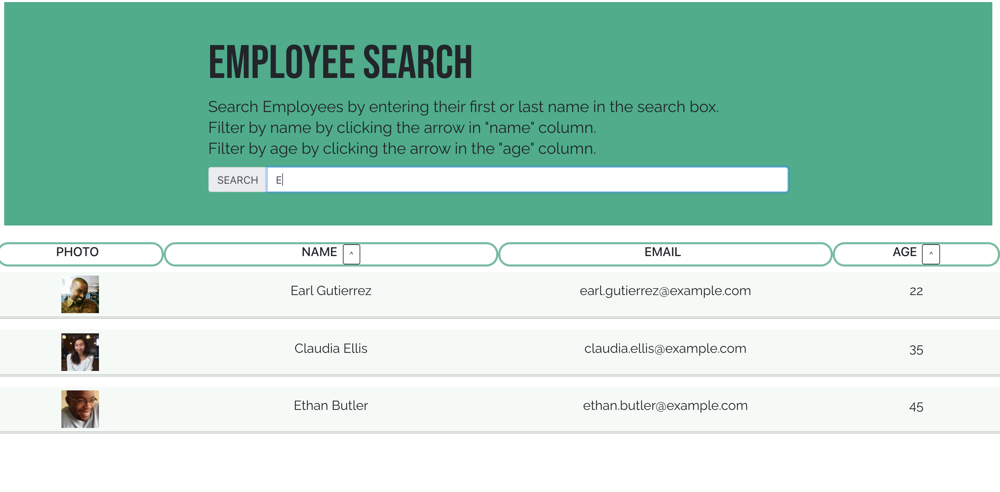

# Employee Tracker
## Table of Contents 
* [Deployed Site](#deployed-site)
*  [Description](#description)
* [Usage Instructions](#usage-instructions)
*  [Technologies Used](#technologies-used)
*  [Have Questions?](#have-questions)

## Deployed Site

    https://anderam17.github.io/react-employee-tracker/

## Description

    This app allows the user to easily search and find basic information on their coworkers and employees. The user can type the first and/or last name of the employee they are looking for in the search bar and the table will be automatically filtered. The user can also sort the entire employee list by either name or age by clicking the buttons in the respective column headings." 

## Usage Instructions

    When the user opens the app, they will be taken to the above page. From here, they can search by name or filter alphabetically by name or by ascending age.

    To sort by name, the user clicks on the arrow at the top of the name column. 

    To sort by age, click on the arrow at the top of the age column. 

    To search by name, the user needs to simply start typing the name they want into the input field. The list will automatically be filtered with each character. As shown in the picture above, it will filter by first and last name containing the entered string.

## Technologies Used

    React.js, Node.js, JavaScript, Bootstrap, 

## Have Questions?
    Contact me!
    GitHub username: anderam17
    Email: allana.anderson17@gmail.com